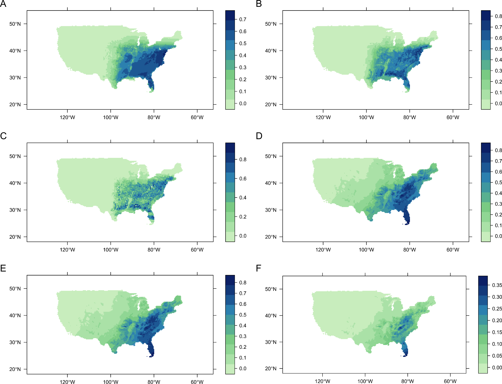

# Abstract

1. The rapid growth of species distribution modelling (SDM) as an ecological discipline has resulted in a large and diverse set of methods and software for constructing and evaluating SDMs.
The disjointed nature of the current SDM research environment hinders evaluation of new methods, synthesis of current knowledge, and the dissemination of new methods to SDM users.

2. The zoon R package aims to overcome these problems by providing a modular framework for constructing reproducible SDM workflows.
zoon modules are interoperable snippets of R code, each carrying out an SDM method, that zoon combines into a single analysis object.

3. Rather than defining these modules, zoon instead draws modules from an open, version-controlled online repository.
zoon makes it easy for SDM researchers to contribute modules to this repository, enabling others to rapidly deploy new methods in their own workflows, or to compare alternative methods.

4. Each workflow object created by zoon is a re-runnable record of the data, code and results of an entire SDM analysis.
This can then be easily shared, scrutinized, reproduced and extended by the whole SDM research community.

5. We explain how zoon works and demonstrate how it can be used to construct a complete reproducible SDM analyses, create and share a new module, and perform a methodological comparison study. 


```{r knitrOpts, echo = FALSE, cache = FALSE, eval = TRUE}
# set up knitr options
knitr::opts_chunk$set(fig.path = 'figs/',
               message = FALSE,
               warning = FALSE,
               fig.align = 'center',
               dev = c('png'),
               cache = TRUE)
```

```{r raster_dir, echo = FALSE, cache = FALSE, eval = TRUE}
# set a place for the rasters to be downloaded to (to stop them being grabbed
# again each time)
raster_dir <- './raster_data'
if (!dir.exists(raster_dir)) dir.create(raster_dir)
options("rasterDataDir" = raster_dir)
```

# Introduction

Species distribution modelling (SDM) has grown rapidly over the last 20 years.
It is now one of “the most widely-reviewed topics in the ecological literature” [@Araujo2012] and the growth of this literature is still accelerating [@Barbosa2015].
The SDM software market is similarly large and diverse [@Ahmed2015].
Whilst most SDM users rely either on the MaxEnt standalone application [@Phillips2006] or the R programming language [@R] as the first choice software for their analyses [@Ahmed2015], there are many competing SDM-specific R packages, each implementing different approaches to fitting SDMs [@Thuiller2009; @dismo; @Naimi2016], as well as a range of alternative standalone applications.

As a result, the SDM community is divided into research silos, with groups of researchers collaborating primarily with others who use the same software, even within specific R packages [@Ahmed2015], presenting a barrier to disseminating new SDM findings and methods.
This is compounded by the almost all available SDM software being focussed on analytical tasks such as constructing models, rather than enabling scientists to produce analyses that others can reproduce and modify.
The inability of SDM researchers to reproduce, scrutinise, and build on others' research prevents rigorous peer review and synthesis of research findings across studies, as well as its capacity to be a self-correcting process [@Boulton2012].

For example, a fundamental dispute over the ability of SDM to detect environmental associations [@Beale2008, @Araujo2009, @Beale2009] was left unresolved as only the original publication shared their analytical code [@Beale2008].
Similarly, in the past decade the SDM community has failed to carry out any large scale comparisons of SDM methods, still relying on the work of @Elith2006 to make decisions, despite the development of hundreds of new methods as well as improved evaluation procedures [@Roberts2016].
The community's inability to repeat this comprehensive analysis is due to both lack of access to comparable data and the difficulty in learning and applying the many different pieces of software for model fitting.

The SDM community's inability to compare models and repeat analyses has left the field unable to decisively answer even basic questions about how best to do SDM.
It may also have contributed to widespread misunderstandings about how apply and interpret different modelling approaches [@Yackulic2013].
In order to overcome these problems, the data and methods underpinning SDM research need to be made more accessible, reproducible and modifiable by the whole research community.
This can be achieved if technologies enable and encourage sharing of research as fully reproducible objects [@Peng2011], in ways that suit the diversity of users involved in SDM [@Ahmed2015].

The zoon R package has been developed specifically to improve reproducibility and comparability of SDM in R by allowing users to encode entire SDM analyses as reproducible workflows of independently executable, community-contributed modules.
The module-workflow structure enables scientists to more easily create and share components of their analysis; and then access, modify, reuse and combine the components of others (see below and Figure 1).
Whilst zoon's modular nature is similar to other SDM R packages such as BioMod2 [@Thuiller2009] and sdm [@Naimi2016], zoon instead pulls each module from an open repository that any SDM user can contribute to, and makes it easy for non-developers to contribute modules.
zoon's focus on reproducibile and modifiable workflows is inspired by workflow systems such as Taverna [@Wolstencroft2013a] and the BIOVEL system [@DeGiovanni2015; @DeGiovanni2016], but embeds an SDM-specific workflow system within R, making it much more accessible to the SDM community.

This paper introduces version 0.5-3 of the zoon R package.
We describe the modular structure of zoon workflows and how they can be constructed, shared, reproduced and modified.
We then illustrate how these concepts enable better SDM research by reproducing a published SDM analysis; converting a recently proposed method into a zoon module; and performing a reproducible methodological comparison.

# Building a workflow

zoon encodes SDM analyses as a simple workflow of five key steps: obtaining occurrence data; obtaining covariate data; applying some processes to these data; fitting one or more models; and generating any outputs (Figure 1A).
Each of these steps is encoded as one or more software modules of a given type.
Users combine these modules via a call to the `workflow` function, which executes each module in turn, before returning a `zoonWorkflow` object - a shareable, extensible and fully reproducible documentation of the SDM analysis.
Figure 1B illustrates how data and outputs are passed between modules of the five different types in a a zoon workflow.


```{r flow_diagram, echo = FALSE, out.width = "375px", fig.cap = "The modular SDM structure encoded by a zoon workflow. A) Description of the five module types. B) Flow diagram illustrating how objects are passed between different module types: `data frame' - an occurrence dataframe; `ras' - a RasterStack object; `mod' - a ZoonModel object; `?' - any user-defined inputs or outputs. C) The flow diagram implied by chaining two `process' modules. D) The flow diagram implied by listing three `model' modules. Full details of module inputs and outputs, and the effects of listing and chaining each module type are given in the zoon vignette `Building a module'."}
knitr::include_graphics("figs/diagrams.png")
```

The following code uses `workflow` to run simple a presence-background SDM for a mosquito species in the UK, fitting a MaxEnt model with default settings and 500 randomly placed background points.

```{r plotworkflow, eval = FALSE, echo = TRUE}
mosquito1 <- workflow(occurrence = UKAnophelesPlumbeus,
                      covariate  = UKBioclim,
                      process    = Background(n = 500),
                      model      = MaxEnt,
                      output     = InteractiveMap)
```

## Chains, Lists and Replicates

Many SDM analyses apply more than one method in one of the five SDM steps, for example to combine multiple covariates and processing steps, to compare various models on the same dataset, or to run the same procedure for several species.
zoon enables these more complex workflows by enabling users to pass multiple modules of each type via the `list`, `Chain` and `Replicate` functions.

### Chain

`Chain` runs multiple modules of the same type *sequentially*, as illustrated in Figure 1C.
For example, in a presence-only analysis a chain of two process modules could be used to generate background data and then to standardise the covariate rasters using the presence/background dataset.
Chains can also be applied to occurrence or covariate modules, to combine multiple datasets (e.g. occurrences from different databases) into one.
Chaining output modules simply runs each module separately, allowing the user to create multiple maps and summary figures, calcualte performance metrics and create other model outputs in one workflow.
Model modules are the only module type that may not be chained, since their outputs and inputs are always different.

### list

`list` splits a workflow, with each path using a different one of the listed modules, as illustrated in Figure 1D.
For example listing multiple model modules would take the same occurrence and covariate data and fit three separate models, applying the same output modules to each model separately.
Lists can also be used to run the same SDM procedure for multiple species, or for multiple sets of covariates, or to compare different process modules.
Listing output modules has the same effect as chaining them, each module is applied separately.

### Replicate

Some steps in SDM analyses are stochastic and need to be run multiple times; `Replicate` enables this by generating a list with one module repeated a given number of times.
`Replicate` could be used to run the same workflow for hundreds of simulated occurrence or covariate datasets, to generate multiple bootstraps for modelling, or to fit models with stochastic elements

###

The following workflow uses a chain to standardise the covariate rasters as well as generating background records, and uses a list to fit three different models: MaxEnt, Boosted Regression Trees (GBM) and RandomForest.
The results of the three models are then returned in three Shiny apps allowing the user to interactively explore the occurrence and covariate data, model summaries and prediction maps.

```{r workflow2, eval = FALSE, echo = TRUE}
mosquito2 <- workflow(occurrence = UKAnophelesPlumbeus,
                      covariate  = UKBioclim,
                      process    = Chain(Background(n = 500),
                                         StandardiseCov),
                      model      = list(MaxEnt,
                                        GBM,
                                        RandomForest),
                      output     = Appify)
```

### Sharing workflows

The `zoonWorkflow` object returned by `workflow` contains all of the data, code and results used in each stage of the analysis.
The object is therefore a self-contained representation of an entire analysis which can be saved as a binary `RData` object, archived, shared with colleagues or uploaded to the web.
Anyone else may then load the object into their R session, load the zoon R package, and investigate the analysis.

zoon provides the `ZoonFigshare` function to facilitate sharing a completed workflow object from within R, via the free web platform figshare. `ZoonFigshare` takes a workflow object and some minimal metadata and uploads the workflow as an RData object, along with a metadata text file, to the user's figshare profile for others to download, inspect and modify.

### Exploring workflows

`zoonWorkflow` objects are simply R lists containing the outputs from each module in the workflow, as well as the modules used, their versions and arguments and information about the R session in which the workflow was run.

The overall structure of a `zoonWorkflow` object can be inspected and visualised using the provided `print` and `plot` methods.
The outputs and intermediate steps of the analysis can be extracted directly from the `zoonWorkflow` object, or by using the utility functions `Occurrence`, `Covariate`, `Process`, `Model` and `Output` to extract the outputs of each analytical stage.
These functions return either the single R object outputted by each module, or list of objects when a list of modules was used in the workflow.

### Reproducing and extending workflows

Given a `zoonWorkflow` object, the analysis can be repeated in its entirety using the zoon function `RerunWorkflow`.
This function can therefore be used to rapidly update an analysis whenever the underlying occurrence or covariate data aree updated.
`RerunWorkflow` can also run from a specific stage of the workflow, for example using the previously downloaded data stored in the object but re-running an output module to generate a plot.

Workflows can similarly be modified and re-run by replacing or adding modules in one or more of the five analytical steps using the function `ChangeWorkflow`.
`ChangeWorkflow` only re-runs the channged modules and those downstream; the stored outputs of earlier modules are re-used rather than re-running them.

This functionality therefore enables researchers to explore and alter existing workflows, such as from a published analysis, without having to re-run computationally expensive models or re-download datasets that may have changed in the interim. See example 2 below for a demonstration of this functionality.

### Exploring available modules

zoon modules are not distributed with the zoon R packages, but are instead downloaded on-the-fly for the online module repository.
New modules uploaded to the repository therefore become instantly available to zoon users, without having to update the R package.
zoon can query the currently available modules of each type via the function `GetModuleList`.

All zoon modules on the repository are accompanied by documentation and metadata, similarly to R's helpfiles.
The documentation for any module on the repository can be accessed from R using the function `ModuleHelp`.
zoon also provides a function `ZoonCitation` to provide citation information; similarly to the `citation` function provided with R for citing R packages.
A web service for interactive exploration of available modules and their documentation will also be made available soon.


### Cross-validation and external validation

`workflow` handles cross-validation and external validation internally, storing this information in the datframe of occurrence records.
*Occurrence* or *process* modules can be used to assign records to one or more cross-validation folds (positive integers indicating different hold-out groups) or to an external validation dataset (indicated by a zero).
At the *model* stage, `workflow` fits a separate model for each cross-validation fold then makes and stores predictions for the hold-out datapoints, as well as fitting a model using the whole dataset.
In all model fitting, records flagged for external validation are omitted.
These cross-validation predictions can then be subsequently analysed by *output* modules to estimate out-of sample predictive performance.
Predictions can be also be made from the full model to an external validation dataset and evaluated.

### Example Applications

Next we demonstrate how zoon can be used in practice for running SDMs, creating and sharing new modules, and performing a methods comparison. The workflow objects created by these analyses can be accessed at [`figshare.com/articles/zoon_applications_paper_workflows`](http://figshare.com/articles/zoon_applications_paper_workflows).
We encourage readers to download, interrogate and alter these workflows for themselves.

#### Example 1. Modelling the potential distribution of nine-banded armadillo in the USA

@Feng2015 constructed a MaxEnt species distribution model for nine-banded armadillo in the USA using presence-only data on the species' current distribution, and the bioclim [@Hijmans2005] set of environmental correlates.
This model was then used to predict areas in the Americas which may be suitable for the species to become established. 

Such a model can be quickly and easily re-constructed as a zoon workflow using modules available in the zoon module repository.
@Feng2015 used a combination of occurrence data from GBIF, and additional occurrence data manually collected from the published literature.
Unfortunately the latter data have not been made publically available, so here we use only data from GBIF.
If the additional data had been made available it would be straightforward to incorporate them, for example using the `LocalOccurrenceData` module.

```{r loadzoon, eval = TRUE, echo = FALSE, cache = FALSE}
# Keep cache = FALSE. Not supposed to cache chunks with library()
#  I assume we want this not echoed.
library(zoon)

set.seed(1633)

```


```{r fengworkflow, eval = TRUE, dpi = 600, fig.show = "hide", results = "hide", message = FALSE, fig.height = 7, fig.width = 9}
FengPapes <- 
  workflow(occurrence = SpOcc('Dasypus novemcinctus',
                              extent = c(-130, -20, -60, 60)),
           covariate = Bioclim(extent = c(-130, -20, -60, 60),
                               layers = c(1:4, 6, 9, 10, 12, 15)),
           process = Chain(Clean, 
                           MESSMask,  
                           Background(n = 10000,
                                      bias = 200), 
                           Crossvalidate(k = 5)),
           model = MaxEnt,
           output = PrintMap(points = FALSE,
                             threshold = 0.05,
                             xlim = c(-130, -70),
                             ylim = c(20, 50)))

```

This workflow plots a static map of the predicted distribution, and the underlying data.
This map is shown in Figure 2A and corresponds to figure 3 in @Feng2015.
The resulting workflow contains all the code required to re-run the workflow, the input data and the results of executing each module.
The object `FengPapes` could therefore be saved as a binary file and shared as a reproducible representation of this research.

Next, we update the workflow to produce an interactive map enabling anyone to inspect the data and predictions on a zoomable map, and to inspect the response curves of the fitted model. These outputs are shown in Figure 2, panels B and C.

```{r fengChangeWorkflow, eval = TRUE, fig.show = "hide", fig.height = 9, fig.width = 7.5}
FengPapesUpdate <- 
  ChangeWorkflow(workflow = FengPapes,
                   output = Chain(ResponseCurve(cov = 1),
                                  InteractiveMap))
```

```{r combinefengupdate, eval = TRUE, echo = FALSE, dpi = 600, fig.show = "hide", fig.height = 4.5, fig.width = 4.5}
# combine the static and interactive maps and first effect plot
# load both images
r_map1 <- brick('figs/fengworkflow-1.png')
r_map <- brick('figs/interactive_map.png')
r_resp <- raster('figs/fengChangeWorkflow-1.png')
r_resp <- brick(r_resp, r_resp, r_resp)

# set up layout so that heights are the same for all panels
plot_height <- min(nrow(r_map1), nrow(r_map), nrow(r_resp))

# get rescaling factor for each
rescale_map1 <- plot_height / nrow(r_map1)
rescale_map <- plot_height / nrow(r_map)
rescale_resp <- plot_height / nrow(r_resp)

# get widths
width_map1 <- ncol(r_map1) * rescale_map1
width_map <- ncol(r_map) * rescale_map
width_resp <- ncol(r_resp) * rescale_resp

# set up layout (maximum total of 200 columns) with a gap in between
# mar won't work for these
gap <- 2

# top row: map1 and resp
widths_top <- c(width_map1, width_resp)
widths_top <- round(widths_top * ((200 - (1 * gap)) / sum(widths_top)))
widths_top <- c(widths_top[1], gap, widths_top[2])

top_row <- rep(1:3, widths_top)
bottom_row <- rep(5, length(top_row))

heights <- c(plot_height + 1, plot_height)
heights <- round(heights * ((50 - (1)) / sum(heights)))
heights <- c(heights[1], 1, heights[2])

top_matrix <- do.call(rbind, replicate(heights[1], top_row, simplify = FALSE))
middle_matrix <- matrix(4, nrow = heights[2], ncol = ncol(top_matrix))
bottom_matrix <- matrix(5, nrow = heights[3], ncol = ncol(top_matrix))

mat <- rbind(top_matrix, middle_matrix, bottom_matrix)
layout(mat)

# plot static map
plotRGB(r_map1, maxpixels = Inf)

# add a panel letter
mtext(text = 'A',
        side = 3,
        line = -1.5,
        adj = 0)  

# gap
plot.new()

# plot the response curve
plotRGB(r_resp, maxpixels = Inf,
        scale = max(maxValue(r_resp)))

# add a panel letter
mtext(text = 'B',
        side = 3,
        line = -1.5,
        adj = 0)  

# gap
plot.new()

# plot interactive map
plotRGB(r_map, maxpixels = Inf)

# add a panel letter
mtext(text = 'C',
        side = 3,
        line = -1.5,
        adj = 0)  

```

```{r feng_papes_plots, cache = FALSE, echo = FALSE, out.width = "450px", fig.cap = "Outputs of the workflow objects `FengPapes' and `FengPapesUpdate'. A) Map of the presence data (red), background data (black) and the MaxEnt relative probability of occurrence generated by the `PrintMap' module in the workflow `FengPapes' which encodes a whole published analysis. White areas are masked due to being in the sea or outside the MESS mask. B) A response curve produced by the `ResponseCurve' module for the first covariate, bio1 in the workflow `FengPapesUpdate', which modifies the original analysis workflow. C) A screenshot of the interactive map produced by the `InteractiveMap' modules in the workflow `FengPapesUpdate', displaying raw occurrence data and predicted distribution over a global map, allowing users to interactively explore their results. Any SDM analysis distributed as a zoon workflow can be easily be explored and scrutinized by modifying its output modules using the function `ChangeWorkflow'."}
knitr::include_graphics("figs/combinefengupdate-1.png")
```

#### Example 2. Building a spatial thinning module

@Aiello-Lammens2015 proposed an approach for dealing with spatial sampling bias in presence-only data by `thinning' the presence data, and provide an R package `spThin` to implement their procedure [@spThin].
We can incorporate this approach in a workflow, by defining a simple *process* module that adapts the zoon data into the spThin format, uses this package to apply the algorithm, and converts data back into zoon's expected format again:

```{r spthinmodule, eval = TRUE}
spThin <- function (.data, thin = 50) {
  
  # check these are presence-background data
  stopifnot(all(.data$df$type %in% c('presence', 'background')))
  
  # install & load the package
  zoon::GetPackage('spThin')
  
  # get dataframe & index to presence data
  df <- na.omit(.data$df)
  pres_idx <- which(df$type == 'presence')
  
  # prepare presence data subset and apply thinning
  sub_df <- data.frame(LAT = df$latitude[pres_idx],
                       LONG = df$longitude[pres_idx],
                       SPEC = NA)
  th <- thin(loc.data = sub_df,
             thin.par = thin,
             reps = 1,
             locs.thinned.list.return = TRUE,
             write.files = FALSE,
             write.log.file = FALSE)
  
  # get index to rows in sub_df, update the full dataset and return
  pres_keep_idx <- as.numeric(rownames(th[[1]]))
  .data$df <- rbind(df[pres_idx,][pres_keep_idx, ],
                    df[-pres_idx, ])
  return (.data)
}
```

To convert this code into a zoon module, we need to write it to a standalone file (named `spThin.R`) with the metadata required to build the module documentation. The zoon function `BuildModule` helps with this step, and can also run checks to make sure we got everything right:

```{r buildmodule, eval = TRUE, results = 'hide', fig.keep = 'none'} 
BuildModule(object = spThin,
            type = 'process',
            title = 'Spatial thinning of Presence-only Data',
            description = paste('Apply the stochastic spatial thinning',
                                'algorithm implemented in the spThin',
                                'package to presence data in a',
                                'presence-background dataset'),
            details = paste('Full details of the algorithm are available in',
                            'the open-access article by Aiello-Lammens',
                            'et al. (2015): dx.doi.org/10.1111/ecog.01132'),
            author = 'zoon Developers',
            email = 'zoonproject@gmail.com',
            paras = list(thin = paste('Thinning parameter - the required',
                         'minimum distance (in kilometres) between points',
                         'after applying the thinning procedure')),
            dataType = 'presence-only',
            check = TRUE)
```

This module can now be shared so that others can use it in their zoon workflows.
Modules can be uploaded to the zoon modules repository via the online submission system at [URL TBD].

#### Example 3. Unpacking MaxEnt

The popular MaxEnt SDM model has recently been shown to be equivalent to a Poisson point process model [@Renner2013], and to be closely approximated by a logistic regression model with weights applied to background datapoints [@Warton2010; @Fithian2013; @Renner2015].
Given this close correspondence between MaxEnt and logistic regression, @Renner2013 and others have suggested that MaxEnt's superior predictive performance [@Elith2006] is most likely due to the array of features (candidate covariate transformations) it constructs and its use of regularisation to prevent overfitting.

zoon enables us to investigate this hypothesis by easily comparing MaxEnt models fitted with and without regularisation and feature construction.
We fit MaxEnt with both the usual java implementation as well as the downweighted logistic regression approximation provided in the `maxnet` R package [@maxnet].
We also compare these models with a standard logistic regression model which does not apply the downweighting step.
The following workflow fits these models to a previously published presence-background data on the Caroline wren in the USA [@Royle2012; @maxlike], maps their predictions (Figure 3) and evaluates the predictive performance of each model against the full presence-absence dataset by AUC.
Note that setting the regularisation constant in the `maxnet` package to 0 caused numerical errors, so we use a very small value instead.

```{r maxnet_comparison, dpi = 600, fig.show = "hide", eval = TRUE, out.height = 600, out.width = 600}
maxnet_comparison <- workflow(
  occurrence = CarolinaWrenPO,
  covariate  = CarolinaWrenRasters,
  process    = Chain(SubsampleOccurrence(500),
                     Background(n = 10000),
                     CarolinaWrenValidation),
  model      = list(MaxEnt(args = 'threshold=false'),
                    MaxNet,
                    MaxNet(regmult = 0.005),
                    MaxNet(features = 'l'),
                    MaxNet(regmult = 0.005, features = 'l'),
                    LogisticRegression),
  output     = Chain(PrintMap(points = FALSE),
                     PerformanceMeasures))
```
```{r maxnet_buffer, eval = TRUE, echo = FALSE, dpi = 600, fig.show = "hide", out.height = 7, out.width = 7}

# loop through adding a margin to each of the previous figures
for (i in 1:6) {
  fpath_in <- sprintf('figs/maxnet_comparison-%i.png', i)
  fpath_out <- sprintf('figs/maxnet_buffer-%i.png', i)
  img <- brick(fpath_in)
  ext <- as.vector(extent(img))

  png(fpath_out,
      width = ncol(img),
      height = nrow(img))
  
  par(oma = rep(0, 4), mar = rep(0, 4))
  plot.new()
  plot.window(xlim = ext[1:2],
            ylim = ext[3:4],
            asp = 1)
  plotRGB(img, maxpixels = Inf, add = TRUE)
  
  dev.off()
}
```

```{r maxnet_plotting, eval = TRUE, echo = FALSE, dpi = 600, fig.show = "hide", fig.height = 7, fig.width = 9}

# plot the figure to disk, then plot in a separate chunk with a legend
par(mfrow = c(3, 2))

# loop through plotting them
for (i in 1:6) {
  fpath <- sprintf('figs/maxnet_buffer-%i.png', i)
  img <- brick(fpath)
  plotRGB(img, maxpixels = Inf)
  mtext(LETTERS[i],
        side = 3,
        line = -1.5,
        adj = 0)
}

```

```{r maxnet_plots, cache = FALSE, echo = FALSE, out.width = "450px", fig.cap = "Prediction of the distribution of the Carolina wren from 5 different models, produced by the workflow `maxnet\\_comparison'. A) MaxEnt without threshold features. B) MaxNet with default settings. C) MaxNet without regularisation. D) MaxNet with only linear features. E) MaxNet without regularisation and only linear features. F) Logistic regression. MaxNet with full features but no regularisation (C) gave the most local complexity, indicative of overfitting to the data. The models with only linear features (D-F) had a broader distribution, indicative of underfitting. Differences between MaxNet with linear features and no  regularisation (E) and logistic regression (F) are due to the downweighting applied to background data in the former."}

```

```{r maxent_aucs, eval = TRUE, echo = FALSE}
# AUCs to be embedded in the text below
perflist <- maxnet_comparison$report[seq(2, 12, by = 2)]
AUCs <- sapply(perflist, function(x) x$auc)
names(AUCs) <- c('MaxEnt',
                 'MaxNet',
                 'MaxNet with no regularisation',
                 'MaxNet with only linear features',
                 'MaxNet with only linear features and no regularisation',
                 'Logistic regression')
AUCs <- round(AUCs, digits = 4)
```

The AUC statistics calculated against the presence-absence data were:
```{r results = 'asis', echo = FALSE}
cat(paste(names(AUCs), AUCs, collapse = '; '))
cat('.')
```
As expected, MaxEnt and MaxNet (the logistic regression approximation) generated similar predictions and had similar predictice performance.
Likewise, once the regularisation and features of MaxNet were switched off, both the predictions and performance were very similar to Logistic regression.

Readers interested in a more comprehensive comparison, or in exploring the response curves can easily reproduce and modify the analysis either by editing and re-running the above code block or by downloading the workflow object and using the `ChangeWorkflow` function.

### Future developments

Reproducibility and open science are gaining attention [@Borregaard2016], and journals, funders and governments are increasingly making them a requirement [@McNutt2016; @EC2016; @Obama2013].
Researchers must therefore find ways of at least disseminating code and data, if not making them usable.
Despite numerous platforms for archiving and sharing code and data, users still face a challenge locating and using resources across different platforms.
Increasing the usability of code and data is therefore the real challenge of open and reproducible science.

The size and fractured nature of the SDM research community therefore warrants a discipline-specific open research platform such as zoon to resolve these problems.
By providing a common interface for SDM and the capacity to create and share methodological experiments zoon offers a new opportunity for the SDM community to develop community modelling benchmarks, and resolve scientific and methodological questions in ways that the current culture of publishing cannot achieve.

zoon was both conceived and developed based on input from users.
Continuing and expanding user engagement will be vital to forming a critical mass of ecologists creating and using zoon modules in their research.
To assist users a number of tutorials on using zoon and developing modules are provided on the zoonproject GitHub repository and as vignettes distributed with zoon.
We intend to supplement these with a gallery of research examples and forum whereby the community can discuss and evaluate best SDM practice in a eproducible way.

### References


