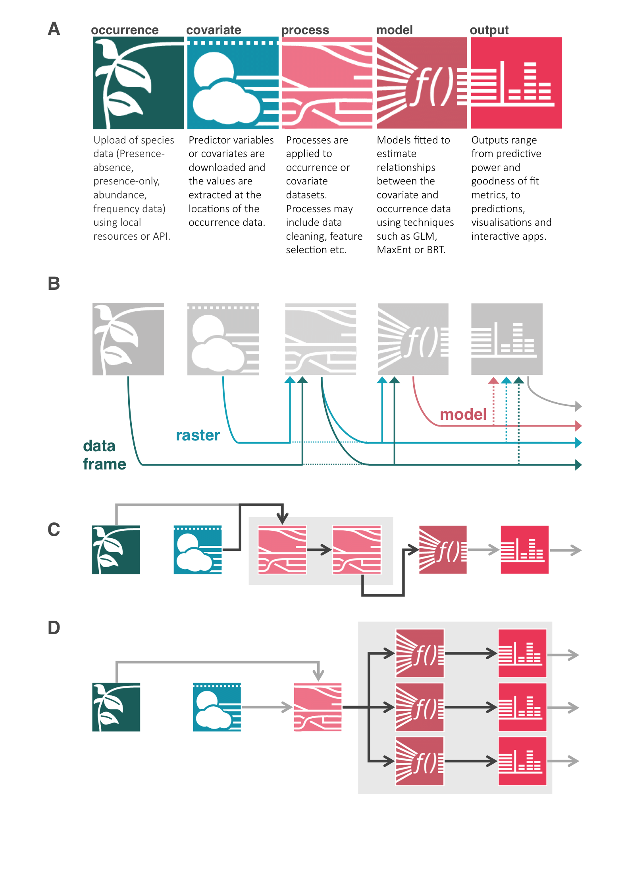
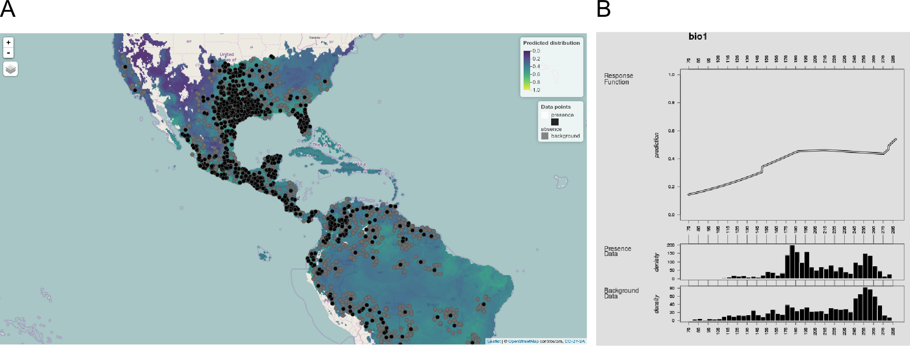

# Abstract

1. The rapid growth of species distribution modelling (SDM) as an ecological discipline has resulted in a large and diverse set of methods and software for constructing and evaluating SDMs.
The disjointed nature of the current SDM research environment hinders evaluation of new methods, synthesis of current knowledge, and the dissemination of new methods to SDM users.

2. The zoon R package aims to overcome these problems by providing a modular framework for constructing reproducible SDM workflows.
zoon modules are interoperable snippets of R code, each carrying out an SDM method, that zoon combines into a single analysis object.

3. Rather than defining these modules, zoon instead draws modules from an open, version-controlled online repository.
zoon makes it easy for SDM researchers to contribute modules to this repository, enabling others to rapidly deploy new methods in their own workflows, or to compare alternative methods.

4. Each workflow object created by zoon is a re-runnable record of the data, code and results of an entire SDM analysis.
This can then be easily shared, scrutinized, reproduced and extended by the whole SDM research community.

5. We explain how zoon works and demonstrate how it can be used to construct a complete reproducible SDM analyses, create and share a new module, and perform a methodological comparison study. 


```{r knitrOpts, echo = FALSE, cache = FALSE, eval = TRUE}
# set up knitr options
knitr::opts_chunk$set(fig.path = 'figs/',
               message = FALSE,
               warning = FALSE,
               fig.align = 'center',
               dev = c('png'),
               cache = TRUE)
```

```{r raster_dir, echo = FALSE, cache = FALSE, eval = TRUE}
# set a place for the rasters to be downloaded to (to stop them being grabbed
# again each time)
raster_dir <- './raster_data'
if (!dir.exists(raster_dir)) dir.create(raster_dir)
options("rasterDataDir" = raster_dir)
```

# Introduction

Like many areas of quantitative science species distribution modelling (SDM) has grown rapidly, fueled by the availability of diverse modelling software and data [@Barbosa2015].
Over the last 20 years, SDM has developed into a very large research community and vast literature.
SDM is now one of “the most widely-reviewed topics in the ecological literature” [@Araujo2012] and the growth of this literature is accelerating [@Barbosa2015].

The SDM software market is similarly diverse [@Ahmed2015].
It comprises many software packages developed specifically for SDM such as the BioMod, BioMod2 [@Thuiller2009], dismo [@dismo] and sdm [@Naimi2016] R packages, the SDMtoolbox python package [@Brown2014] and GUI applications including MaxEnt [@Phillips2006], openModeller [@deSouza2011], BioEnsembles [@Diniz2009] and ModEco [@Guo2010].
A range of other software has also been appropriated for SDM studies, such as statistical software including WinBugs and OpenBugs [@Lunn2000], and more general ecological software such as Domain [@Carpenter1993], Canoco [@TerBraak2002].
However most SDM users replying to a survey in 2015 [@Ahmed2015] used either MaxEnt [@Phillips2006] or R [@R] as the first choice software for their analyses.
As in other computational sub-disciplines, most SDM software focusses on analytical tasks such as constructing models, rather than enabling scientists to share software, and to produce reproducible and modifiable analyses that are essential to the scientific enterprise.

Consequently, computational sciences like SDM suffer from a modern version of the reproducibility problem, as computational research is largely inaccessible, let alone reusable [reference?].
When SDM research materials have been shared, they have rarely been disseminated in a format that enables them to be readily modified or adapted.
This is despite the many available methods for distributing these resources digitally, e,g, via services such as Figshare and GitHub.

A lack of sharing reduces the capacity for innovation and validation in SDM, as well as its capacity to be a self-correcting process [@Boulton2012].
For example, a fundamental dispute over the ability of SDM to detect environmental associations [@Beale2008, @Araujo2009, @Beale2009] was left unresolved as only the original publication shared their analytical code [@Beale2008].
Because the resources required to scrutinize and test each piece of research were not shared, the critical analytical differences between these conflicting studies remain unclear. 

The inability to share code and data also prevents broad-scale methodological comparisons.
The landmark SDM modelling comparison of @Elith2006 has been highly influential in SDM research, having been cited over xxx times.
However in the decade since that study was published there have been no comparisons of a similar scope, despite a rapid increase in the number of available methods for fitting and evaluating SDMs.
The community's inability to repeat this comprehensive analysis is due to both lack of access to the original data and the difficulty in learning and applying the many different pieces of software for model fitting.
Consequently, we currently have a very poor understanding of how different models perform for SDM under different circumstances.

Our inability to synthesise findings across the SDM literature is bolstered by the discontinuous nature of collaboration in SDM research.
Most SDM researchers collaborate with researchers who use the same SDM software [@Ahmed2015].
This limits dissemination of new methods throughout the SDM community due to the need to switch software.
The existence of these research silos may also hinder dissemination of methodological findings, and contribute to widespread misunderstanding about how apply and interpret different modelling approaches [@Yackulic2013].

In order to overcome these problems, the data and models underpinning SDM need to become more accessible, reproducible and modifiable.
This can be achieved by faciliting access to methods developed across the whole research community [open science reference?], and making it easier to share and modify fully reproducible research objects [open science reference?].
The zoon R package aims to address these issues for SDM by allowing users to encode entire SDM analyses as reproducible workflows comprised of independently executable, community-contributed modules.
The module-workflow structure enables scientists to more easily create and share components of their analysis; and then access, modify, reuse and combine the components of others (see below and Figure 1).

### Comparison with existing software

The modular nature of zoon workflows will be familiar to users of other SDM R packages, such as BioMod2 [@Thuiller2009] and sdm [@Naimi2016].
Whilst BioMod2 modules and sdm modules are created by the developers of those packages and contained in the software itself,zoon's modules are drawn from an open repository that any SDM user can contribute to.
zoon makes module writing easy for SDM users who are not expert R developers, and provides functionality to help document, test and upload modules to the repository.
zoon workflows are also designed as reproducible research objects which can be shared, inspected, re-run and modified by swapping in new modules.

This focus on reproducibile and modifiable workflows shares similarities with general-purpose workflow systems such as Kepler [@], Vis-Trails [@], Taverna [@].
The Taverna platform has recently been extended for biodiversity research via the BIOVEL system [@DeGiovanni2015] and provides some SDM functionality via its ENM Components [@DeGiovanni2016].
However adoption of these workflow environments in the SDM research community is low.
Presumably this is due to SDM users’ unfamiliarity with workflow software and the limited number of methods already implemented.
This hurdle is created by requiring users to embed R code within a workflow software, rather than embedding a workflow system within R.

By constrast with existing software, zoon has been custom-built to improve reproducibility of SDM research in R.
By providing a single, extensible access point to various SDM software, it is designed to facilitate a more connected and effective SDM research community.

# The zoon R package

This paper introduces version 0.4-22 of the zoon R package.
We describe the modular structure of zoon workflows and how they can be constructed, shared, reproduced and modified.
We then illustrate how these concepts enable better SDM research by reproducing a published SDM analysis; converting a recently proposed method into a zoon module; and extending a published methodological comparison.

#### Module types

The zoon R package encodes SDM analyses as a simple workflow of five key steps, with each step encoded as one or more software modules. Users combine these modules via a call to the `workflow` function, which executes each module in turn, before returning a `zoonWorkflow` object - a shareable, extensible and fully reproducible documentation of the SDM analysis. Figure 1 illustrates the structure of a zoon workflow comprising the five module types and illustrates how multiple modules may be combined at each stage. The module types and module combination options are described in more detail below.

<!— link to powerpoint doc: https://www.dropbox.com/s/p7rqww2v0h3a7np/diagrams.pptx?dl=0-->

```{r flow_diagram, echo = FALSE, out.width = "375px", fig.cap = "The modular SDM structure encoded by a zoon workflow. A) Flow diagram representing the five module types and intermediate objects: df - an occurrence dataframe; ras - a RasterStack object; mod - a ZoonModel object; ? - any user-defined inputs or outputs. B) The flow diagram implied by chaining modules of the same type. C) The flow diagram implied by listing modules of the same type. Full details of module inputs and outputs, and the effects of listing and chaining each module type are given in the zoon vignette 'Building a module'."}

```


The five module types, corresponding to the five key steps of an SDM analysis are:

<!— remove this, it's covered in the figure —>

- *Occurrence* - Usually presence-absence data or presence-only data, though abundance data is also used.
- *Covariates* - Predictor variables or covariates (typically environmental covariates) are required and the values of these covariates, at the locations of the occurrence data, must be extracted.
- *Process* - Processes applied to the occurrence and covariate data. These processes include data cleaning, data thinning to account for spatial biases, feature selection using PCA or association tests and the splitting of data into training and test sets or cross validation folds.
- *Model* - Once the data has been suitable manipulated a model is fitted to estimate the relationships between the covariates and occurrence data. These models include simple statistical models such as GLMs as well as modern, flexible machine-learning methods such as MaxEnt and boosted regression trees.
- *Output* - The predictive power and goodness of fit must be assessed and the model parameters or response curves must be examined. The model is likely to be used to predict species occurrence, either in the vicinity of the occurrence data or elsewhere, or into the past or future.

Users can query the modules hosted on the repository from their R session using the function `GetModuleList()`, and pull up the documentation for any module in the repository with `ModuleHelp()`.

#### Lists, Chains and Replicates

<!— needs work—>

Many SDM analyses apply more than one method for each of these steps.
zoon enables more complex workflows by enabling users to pass multiple modules of each type via the List, Chain and Replicate functions.

To combine multiple modules of the same type we provide the `Chain` command.
For occurrence and covariate modules, this command takes multiple modules and simply combines the data acquired by each module.
Chained process models are run sequentially.
For example if a user wants to generate background or pseudo absence data and then split the data into crossvalidation folds, modules implementing these two seperate process would be chained in that order.
Finally, chained output modules are simply all run seperately allowing the user to create multiple maps and summary figures, calcualte performance metrics and create other model outputs in one workflow.
Model modules cannot be chained.

Many SDM analyses require running similar workflow in parallel. 
In applied settings this may be running the same analysis for multiple species.
In methodological work, it is important to compare new methods or models to benchmarks.
To divide a zoon workflow into multiple parallel analyses the `list` function is used.
`list` can be used to split the analysis at any point: listing multiple occurrence modules together will run the workflow on different occurrence datasets while listing multiple model modules will fit different models to a shared, identical dataset but then apply output modules to each model separately. In cases where modules containing randomness need to be run many times - such as running a workflow with hundreds of simulated datasets - `replicate` can be used. This simply creates a `list` of the specified module, repeated a given number of times. 

The following workflow demonstrates use of the `Chain`s and `list`s to fit three different SDMs to a presence-background dataset for a UK mosquito species, after standardising the covariates. The results of the three models are then returned in Shiny app allowing the user to interactively explore the occurrence and covariate data, model summaries and prediction maps.

```{r plotworkflow, eval = TRUE, echo = TRUE, fig.height = 4, fig.width = 9, dpi = 300}
work <- workflow(occurrence = UKAnophelesPlumbeus,
                 covariate  = UKBioclim,
                 process    = Chain(Background(n = 500),
                                    StandardiseCov),
                 model      = list(MaxEnt,
                                   GBM,
                                   RandomForest),
                 output     = Appify)
```

### Inspecting, sharing and extending a zoon workflow

A `zoonWorkflow` object
Structure of workflow objects:

* code (call and modules used)
* output of each module; data, results and intermediate steps
* recording the session info and package and module versions

zoon workflows are re-runnable records of the data, code and results of an entire SDM analysis and can be easily reproduced, scrutinized and extended by the whole research community.
A zoon workflow returns an object of class `zoonWorkflow`.
This object contains all the information needed to reproduce the analysis.
This includes the original call, a record of the packages and modules used and their versions when the analysis was run as well as all the data and fitted models.

A workflow is reproducible, reusable and alterable by way of the functions `RerunWorkflow` and `ChangeWorkflow`.
Using `RerunWorkflow` a workflow object can be run from scratch or from part way though the analysis to avoid computationally slow steps.
`ChangeWorkflow` takes as it's arguments a workflow object and new selections for any or all of the workflow steps.
The workflow is then rerun from the first altered step.


Things you can do to workflows: 

* visualise the structure
* execute whole thing from scratch (grabs new data from web)
* execute from part way through

zoon provides functionality to quickly update an existing workflow object (even one created by someone else) by switching out modules.


Include a figure visualising the structure of the workflow object and how it can be adopted in the ChangeWorkflow function (corresponding to an example below?).

#### Building modules

Modules are simply R function definitions, with a set of required inputs and outputs.


As long as a valid module function is defined in an R session, it can be used in workflows in combination with modules downloaded from the zoon module repository.
Whilst this makes it easy to develop modules locally, the strength of zoon comes from the ability to upload modules to the online repository so that others can access them.

To do this, it first is necessary to provide additional metadata including the module tile and description, module type, author name and definitions for any non-mandatory arguments.
zoon provides the function `BuildModule()` to facilitate entering this metadata and checking that it matches the module.

The zoon vignette *Building modules* provides a detailed tutorial for building modules of each type.


#### Additional features

##### Accessing module documentation

<!-- to do -->

All modules, created by the zoon authors or contributed by others, have documentation explaining their methods and how they are used. This documentation is easily accessed in R by using the function `ModuleHelp`. This function fetched the documentation from the module repository. 

##### Cross-validation

<!— needs work—>

`workflow` sensibly handles cross-validation.
Process modules are used to split the data into a training and test set or into multiple folds so that each fold in turn will be held back and used as the test for the predictive ability of any fitted models.
The same test/train splits will be used for each analysis if the multiple models or methods are being used so that model performance measures are comparable.
Furthermore, the test/train splits are saved along with the workflow so that other researchers adding to a workflow can make fair comparisons. 
After models are fitted to these subsets of the data, they are also fitted to the entire dataset as this will provide the best models for predictions from further new data.

##### Sharing workflows

zoon provides the `ZoonFigshare` function to facilitate sharing a completed workflow object from within R, via the free web platform figshare. `ZoonFigshare` takes a workflow object and some minimal metadata and uploads the workflow as an RData object, along with a metadata text file, to the user's figshare profile for others to download, inspect and modify.


### Example Applications

We demonstrate the zoon R package by recreating two SDM analyses from published research articles as zoon workflows and showing how these workflow objects can easily be extended with new modules.
Workflow objects created by these analyses can be accessed at [`figshare.com/articles/zoon_applications_paper_workflows`](http://figshare.com/articles/zoon_applications_paper_workflows).
We encourage readers to download, interrogate and alter these workflows for themselves.
Full code and metadata for all of the modules used in the examples below can be found at [`github.com/zoonproject/modules/R`](https://github.com/zoonproject/modules/R)

#### Example 1. Modelling the potential distribution of nine-banded armadillo in the USA

@Feng2015 constructed a MaxEnt species distribution model for nine-banded armadillo in the USA using presence-only data on the species' current distribution, and the bioclim [@Hijmans2005] set of environmental correlates.
This model was then used to predict areas in the Americas which may be suitable for the species to become established. 

Such a model can be quickly and easily re-constructed as a zoon workflow using modules available in the zoon module repository.
@Feng2015 used a combination of occurrence data from GBIF, and additional occurrence data manually collected from the published literature.
Unfortunately the latter data have not been made publically available, so here we use only data from GBIF.
If the additional data had been made available it would be straightforward to incorporate them, for example using the `LocalOccurrenceData` module.

```{r loadzoon, eval = TRUE, echo = FALSE, cache = FALSE}
# Keep cache = FALSE. Not supposed to cache chunks with library()
#  I assume we want this not echoed.
library(zoon)

set.seed(1633)

```


```{r fengworkflow, eval = TRUE, dpi = 600, fig.show = "hide", results = "hide", message = FALSE, fig.height = 9, fig.width = 9}
FengPapes <- 
  workflow(occurrence = SpOcc('Dasypus novemcinctus',
                              extent = c(-130, -20, -60, 60)),
           covariate = Bioclim(extent = c(-130, -20, -60, 60),
                               layers = c(1:4, 6, 9, 10, 12, 15)),
           process = Chain(Clean, 
                           MESSMask,  
                           Background(n = 10000,
                                      bias = 200), 
                           Crossvalidate(k = 5)),
           model = MaxEnt,
           output = PrintMap(points = FALSE,
                             threshold = 0.05,
                             xlim = c(-130, -70),
                             ylim = c(20, 50)))

```

This workflow plots a static map of the predicted distribution, and the underlying data.
This map is shown in Figure 2A and corresponds to figure 3 in @Feng2015.
The resulting workflow contains all the code required to re-run the workflow, the input data and the results of executing each module.
The object `FengPapes` could therefore be saved as a binary file and shared as a reproducible representation of this research.

Next, we update the workflow to produce an interactive map enabling anyone to inspect the data and predictions on a zoomable map, and to inspect the response curves of the fitted model. These outputs are shown in Figure This map is shown in Figure 2, panels B and C.

```{r fengChangeWorkflow, eval = TRUE, fig.show = "hide", fig.height = 9}
FengPapesUpdate <- 
  ChangeWorkflow(workflow = FengPapes,
                   output = Chain(ResponseCurve(cov = 1),
                                  InteractiveMap))
```

```{r combinefengupdate, eval = TRUE, echo = FALSE, dpi = 600, fig.show = "hide", fig.height = 4.5, fig.width = 4.5}
# combine the static and interactive maps and first effect plot
# load both images
r_map1 <- brick('figs/fengworkflow-1.png')
r_map <- brick('figs/interactive_map.png')
r_resp <- raster('figs/fengChangeWorkflow-1.png')
r_resp <- brick(r_resp, r_resp, r_resp)

# set up layout so that heights are the same for all panels
plot_height <- min(nrow(r_map1), nrow(r_map), nrow(r_resp))

# get rescaling factor for each
rescale_map1 <- plot_height / nrow(r_map1)
rescale_map <- plot_height / nrow(r_map)
rescale_resp <- plot_height / nrow(r_resp)

# get widths
width_map1 <- ncol(r_map1) * rescale_map1
width_map <- ncol(r_map) * rescale_map
width_resp <- ncol(r_resp) * rescale_resp

# set up layout (maximum total of 200 columns) with a gap in between
# mar won't work for these
gap <- 2

# top row: map1 and resp
widths_top <- c(width_map1, width_resp)
widths_top <- round(widths_top * ((200 - (1 * gap)) / sum(widths_top)))
widths_top <- c(widths_top[1], gap, widths_top[2])

top_row <- rep(1:3, widths_top)
bottom_row <- rep(5, length(top_row))

heights <- c(plot_height + 1, plot_height)
heights <- round(heights * ((50 - (1)) / sum(heights)))
heights <- c(heights[1], 1, heights[2])

top_matrix <- do.call(rbind, replicate(heights[1], top_row, simplify = FALSE))
middle_matrix <- matrix(4, nrow = heights[2], ncol = ncol(top_matrix))
bottom_matrix <- matrix(5, nrow = heights[3], ncol = ncol(top_matrix))

mat <- rbind(top_matrix, middle_matrix, bottom_matrix)
layout(mat)

# plot static map
plotRGB(r_map1, maxpixels = Inf)

# add a panel letter
mtext(text = 'A',
        side = 3,
        line = -1.5,
        adj = 0)  

# gap
plot.new()

# plot the response curve
plotRGB(r_resp, maxpixels = Inf,
        scale = max(maxValue(r_resp)))

# add a panel letter
mtext(text = 'B',
        side = 3,
        line = -1.5,
        adj = 0)  

# gap
plot.new()

# plot interactive map
plotRGB(r_map, maxpixels = Inf)

# add a panel letter
mtext(text = 'C',
        side = 3,
        line = -1.5,
        adj = 0)  
```

```{r feng_papes_plots, cache = FALSE, echo = FALSE, out.width = "450px", fig.cap = "Outputs of the workflow objects `FengPapes' and `FengPapesUpdate'. A) Map of the presence data (red), background data (black) and the MaxEnt relative probability of occurrence generated by the `PrintMap' module in the workflow `FengPapes'. White areas are masked due to being in the sea or outside the MESS mask. B) A response curve produced by the `ResponseCurve' module for the first covariate, bio1 in the workflow `FengPapesUpdate'. C) A screenshot of the interactive map produced by the `InteractiveMap' modules in the workflow `FengPapesUpdate', displaying raw occurrence data and predicted distribution over a global map, allowing users to interactively explore their results."}

```

#### Example 2. Building a spatial thinning module

@Aiello-Lammens2015 proposed an approach for dealing with spatial sampling bias in presence-only data, by 'thinning' the presence data, and provide an R package `spThin` to implement their procedure [@spThin].
We can incorporate this approach in a workflow, by defining a simple *process* module that adapts the zoon data into the spThin format, uses this package to apply the algorithm, and converts data back into zoon's expected format again:

```{r spthinmodule, eval = TRUE}
spThin <- function (.data, thin = 50) {
  
  # check these are presence-background data
  stopifnot(all(.data$df$type %in% c('presence', 'background')))
  
  # install & load the package
  zoon::GetPackage('spThin')
  
  # get dataframe & index to presence data
  df <- na.omit(.data$df)
  pres_idx <- which(df$type == 'presence')
  
  # prepare presence data subset and apply thinning
  sub_df <- data.frame(LAT = df$latitude[pres_idx],
                       LONG = df$longitude[pres_idx],
                       SPEC = NA)
  th <- thin(loc.data = sub_df,
             thin.par = thin,
             reps = 1,
             locs.thinned.list.return = TRUE,
             write.files = FALSE,
             write.log.file = FALSE)
  
  # get index to rows in sub_df, update the full dataset and return
  pres_keep_idx <- as.numeric(rownames(th[[1]]))
  .data$df <- rbind(df[pres_idx,][pres_keep_idx, ],
                    df[-pres_idx, ])
  return (.data)
}
```

To convert this code into a zoon module, we need to write it to a standalone file (named `spThin.R`) with the metadata required to build the module documentation. The zoon function `BuildModule()` helps with this step, and can also run checks to make sure we got everything right:

```{r buildmodule, eval = TRUE, results = 'hide', fig.keep = 'none'} 
BuildModule(object = spThin,
            type = 'process',
            title = 'Spatial thinning of Presence-only Data',
            description = paste('Apply the stochastic spatial thinning',
                                'algorithm implemented in the spThin',
                                'package to presence data in a',
                                'presence-background dataset'),
            details = paste('Full details of the algorithm are available in',
                            'the open-access article by Aiello-Lammens',
                            'et al. (2015): dx.doi.org/10.1111/ecog.01132'),
            author = 'zoon Developers',
            email = 'zoonproject@gmail.com',
            paras = list(thin = paste('Thinning parameter - the required',
                         'minimum distance (in kilometres) between points',
                         'after applying the thinning procedure')),
            dataType = 'presence-only',
            check = TRUE)
```

This module can now be shared so that others can use it in their zoon workflows. The best way of sharing it is via the zoon modules repository. Modules can uploaded there, via the module submission system at [URL TBD].

#### Example 3. Evaluating MaxLike

@Royle2012 proposed a model for fitting SDMs to presence-only data, which they suggest is able to estimate the absolute (rather than relative) probability of species presence in each grid cell.
This model and the associated claims have been the subject of several research articles evaluating the model against both real-world and simulated datasets [@Fitzpatrick2013;@Merow2014;@Hastie2013;@Phillips2013].

In this example we illustrate how zoon can help contribute to discussions such as these by enabling rapid evaluation of a new method against a variety of datasets and test procedures.

For this example, it was necessary to create three new modules: two to load the presence/absence and presence-only Carolina Wren datasets from @Royle2012; and one to implement the MaxLike model.

<!-- Possible experiments:
* evaluating with different criteria (e.g. deviance or pseudo-r-squared which measure calibration capacity)
* fitting the same models with GBIF data and evaluating against the BBS PA data,
* fitting/evaluating on spatially-stratified holdout data
* fitting the models with other species
  (choose only one of these)
  -->

All of these have now been uploaded to the zoon modules repository under the names `CarolinaWrenPO`, `CarolinaWrenPA`, `CarolinaWrenRasters` and `MaxLike`.

What the workflow looks like:

```{r merowworkflowtemp, dpi = 600, eval = TRUE}
Merow_Silander <- workflow(
    occurrence = CarolinaWrenPO,
    covariate = CarolinaWrenRasters,
    process = Background(n = 10000),
    model = list(LogisticRegression, MaxEnt, MaxLike),
    output = Chain(PerformanceMeasures, PrintMap(points = FALSE)))
```


```{r merowworkflow,dpi = 600, eval = FALSE}

Merow_Silander <- workflow(
    occurrence = CarolinaWrenPO,
    covariate = CarolinaWrenRasters,
    process = Chain(Transform(trans = 'square',
                                 replace = FALSE), 
                       Background(n = 10000)),
    model = list(LogisticRegression, MaxEnt, MaxLike),
    output = Chain(PerformanceMeasures, PointBiserialCorr, PrintMap(points = FALSE), Coefficients))
```

So we ran it again with disc-based spatial stratification:

```{r merowChangeWorkflow, dpi = 600, eval = FALSE}
Merow_Silander_Spatial <- ChangeWorkflow(
    merow_and_silander,
    process = Chain(..., PartitionDisc))
```

### Future developments

Reproducibility, open-data and open-science are topics that receive ever more attention all across science.
Journals [@McNutt2016] and funders [@EC2016] are moving towards openly shared data and code resources as a requirement, as was set out in the executive order issued by US President Barack Obama in 2013 [@Obama2013].
These trends strongly suggest researchers must at least find ways of documenting and disseminating code and data, if not ways that enable end users. Numerous platforms for publishing analytical outputs exist (e.g. GitHub, figshare, Dryad, CRAN), but end users will still face the demands of locating, deciphering and managing different resources across different platforms.
Then, the real challenge of open and reproducible science, that has an increased capacity for innovation, is the challenge of increasing the usability of code and data.

However, “scientific software is developed either by domain scientists who have little training in user interface (UI) or experience (UX) design, or by software engineers who build broad systems that do not suit the niche needs or practices of domain scientists” [@Thomer2016].
Then, there is a need for environments that can address niche needs (e.g. of a modelling discipline such as SDM) and that address usability issues for diverse outputs produced by diverse scientists.
The SDM community is large enough to warrant a discipline specific platform such as zoon.
The Zoon Project offers a new opportunity for the SDM community to develop community modelling benchmarks, and resolve scientific and methodological questions in ways that the current culture of publishing cannot achieve.
It may be that zoon can also be used for other modelling activities that have similar workflows, or use similar data and processing steps. 

During the development of zoon we have improvised a user-centred, participatory design process that builds on our prior experiences with software development and soliciting user feedback at 3 stages.
An ideation workshop set the initial requirements before any code was written, and two further workshops have allowed users input on an initial prototype distributed via GitHub and then a stable R package.
This is by no means a full UX approach [@Pavelin2012], but it has directly informed the design. 
Continued user engagement will be vital to developing a critical mass of zoon modules that can incentivise modellers to contribute to community resources that enable evidence-based decisions about best practice.
An important step would be the publication of a large model inter-comparison within the zoon environment, such as that produced by @Elith2006 or more recently in @Beaumont2016.
At present, studies such as these might be considered as ‘closed knowledge’ even if they were reproducible from the publication.
In order to facilitate a user –friendly approach to distributed working, future work will include the development of an online interface for accessing a repository of contributed modules and modifying workflows.
This interface might also host methodological discourse and openly evaluate proposed best practices in SDM.
In sum, we hope that the zoon R package represents a step towards a more reproducible ecosystem of SDM software.  

To assist users a number of tutorials are provided on the GitHub repository and as vignettes distributed with zoon – including  guides on creating workflows and modules, as well as full technical details for module developers.

### References


