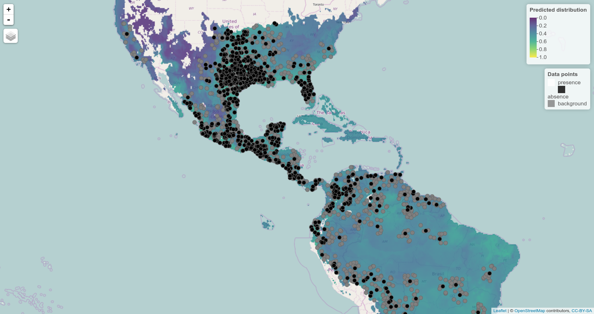

# The `zoon` R package for reproducible and shareable species distribution modelling

## Nick Golding, Tom August, Tim C.D. Lucas, Emiel Van Loon & Greg McInerny

### Abstract

1. The diverse array of software and methodological research available for species distribution modelling (SDM) hinders independent evaluation of new methods and their dissemination to SDM users.  

2. The `zoon` R package encodes SDM analyses as a simple, but fully reproducible workflow of five steps: obtaining occurrence data, obtaining covariate data, pre-processing these data, fitting a model, and generating outputs.

3. Each of these steps is carried out by one or more community-contributed software modules maintained in a version-controlled online repository and built upon existing SDM code form R-packages and the research community.

4. `zoon` workflows are re-runnable records of the data, code and results of an entire SDM analysis and can be easily reproduced, scrutinized and extended by the whole research community.
 
5. We demonstrate `zoon` by recreating SDM analyses from two published research articles as zoon workflows, which readers can interrogate and extend.

### Introduction

<!-- The Problem -->
Reproducibility crisis in species distribution modelling (SDM).
Difficult for new SDM users to access latest methods.
Difficult for anyone to compare methods effectively. 
Equally difficult for methods developers to disseminate their advances.

<!-- The Solution: ZOOOOOON!  -->
The `zoon` R package encodes SDM analyses as a simple workflow of five steps: obtaining occurrence data, obtaining covariate data, pre-processing these data, fitting a model, and generating outputs.
Each of these steps is carried out by one or more community-contributed software modules. 
This framework facilitates rapid dissemination of novel SDM methodologies by lowering the bar to creating research software.
`zoon` workflows are re-runnable records of the data, code and results of an entire SDM analysis and can be easily reproduced, scrutinized and extended by the whole research community.
 
<!-- How It Works -->
### Implementing a `zoon` workflow

Module types (and examples) in a diagram (Figure 1).


Structure of workflow objects:

* code (call and modules used)
* output of each module; data, results and intermediate steps
* recording the session info and package and module versions

Extra stuff workflows do (handle cross validation, run parallel methods/data comparisons).

Things you can do to workflows:

* visualise the structure
* execute whole thing from scratch (grabs new data from web)
* execute from part way through

Include a figure visualising the sturcutre of the workflow object and how it can be adopted in the ChangeWorkflow function (corresponding to an example below?).

### Example Applications

We demonstrate the `zoon` R package by recreating two SDM analyses from published research articles and extending them.
Workflow objects created by these analyses can be accessed at [http://figshare.com/articles/zoon_applications_paper_workflows](http://figshare.com/articles/zoon_applications_paper_workflows).
We encourage readers to download, interrogate and alter these workflows for themselves.
Full code and metadata for all of the modules used in the examples below, can be found at [https://github.com/zoonproject/modules/R](https://github.com/zoonproject/modules/R)

#### Re-running a fairly simple SDM, tweaking some different stuff and looking at the results 

Explanation & citation

One of the modules we had to write:

```r
AwesomeModule <- function(.df) {
    something
    return (something else)
}
```

What the workflow looks like

```r
carruthers_et_al <- workflow(
    occurrence = ...,
    covariate = ...,
    process = ...,
    model = ...,
    output = ...)
```

Some tweak we did to it:

```r
carruthers_et_al_interactive <- ReRunWorkflow(
    carruthers_et_al,
    output = InteractiveMap)
```



Some plottable results of this analysis 

#### Repeating a MEE methods comparison 

Proposed paper:

>Merow & Silander (2014) A comparison of Maxlike and Maxent for modelling species distributions. *Methods in Ecology and Evolution*

This is a method that saw a lot of discussion and for which more experiments could be useful.

Possible experiments:
* evaluating with different criteria (e.g. deviance or pseudo-r-squared which measure calibration capacity)
* fitting the same models with GBIF data and evaluating against the BBS PA data,
* fitting/evaluating on spatially-stratified holdout data
* fitting the models with other species

(choose only one of these)


One of the modules we had to write (simpler than the MaxLike one!):

```r
CarolinaWrenPO <- function() {
  
  # load maxlike and the dataset into this environment
  zoon::GetPackage('maxlike')
  data(carw, envir = environment())
  occ <- na.omit(carw.data$pa.data)

  # keep only presences
  occ <- occ[occ$y == 1, ]
  
  # build the occurrence dataset and return
  data.frame(longitude = occ$Lon,
             latitude = occ$Lat,
             value = occ$y,
             type = 'presence'),
             fold = 1)
  
}
```

What the workflow looks like:

```r
merow_and_silander <- workflow(
    occurrence = CarolinaWrenPO,
    covariate = ...,
    process = ...,
    model = list(MaxEnt, MaxLike),
    output = ...)
```

So we ran it again with disc-based spatial stratification:

```r
merow_and_silander_spatial <- ReRunWorkflow(
    merow_and_silander,
    process = Chain(..., PartitionDisc))
```

### Future developments

Tutorials on how to create workflows and modules, as well as full technical details for module developers, are provided as vignettes distributed with `zoon`.

While the `zoon` R package can be used in isolation, future work will develop an online platform to facilitate exploring contributed modules and workflows.
This platform will also provide an online space to discuss, and openly evaluate, proposed best practices in SDM.
The zoon R package therefore represents a step towards a more reproducible ecosystem of SDM software. 


